<p align="center">
  
</p>

<p align="center">
  <a href="#установка"></a>
  
  
  <a href="LICENSE"></a>
  
</p>

# NotchMate

> [!WARNING]
> **Бета-версия.** NotchMate работает каждый день, но ещё обкатывается: возможны ошибки, а интерфейс и настройки будут меняться. Если что-то пошло не так, заведите issue.

Умный помощник за вырезом камеры MacBook: музыка, заметки, задачи, встречи, созвоны и ИИ-чат в одной панели, которая выезжает из выреза.

> 🇬🇧 **English summary.** NotchMate is a macOS notch companion: now playing, quick notes (Obsidian / Apple Notes), Jira, calendar, call recording with local transcription, focus timer, clipboard history, a file shelf and an AI chat (Claude Code, Codex, OpenAI or any OpenAI-compatible server). The UI is in Russian. Download the app from Releases or build with `./build.sh` (macOS 14+, Apple Silicon). MIT licensed. **Beta**: expect rough edges.

## Помощник

У NotchMate есть живая пиксельная мордочка. Она пританцовывает под музыку, сосредотачивается во время фокуса, реагирует на файлы и зарядку и напоминает попить воды. Всего у неё почти 40 анимаций, ниже настоящие кадры из приложения:

<p align="center">
  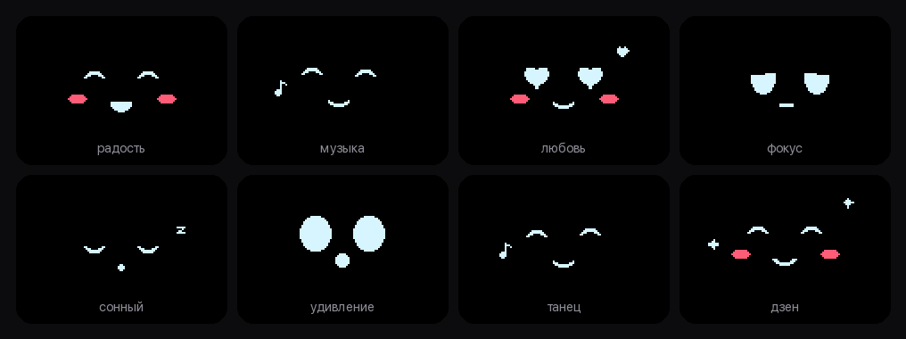
</p>

<a id="как-это-выглядит"></a>
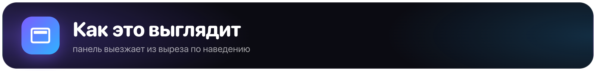

Наведите курсор на вырез, и панель выедет вниз. Вкладки: Помощник, Музыка, Здоровье, Работа, Заметки и Полка.

<table>
  <tr>
    <td width="50%">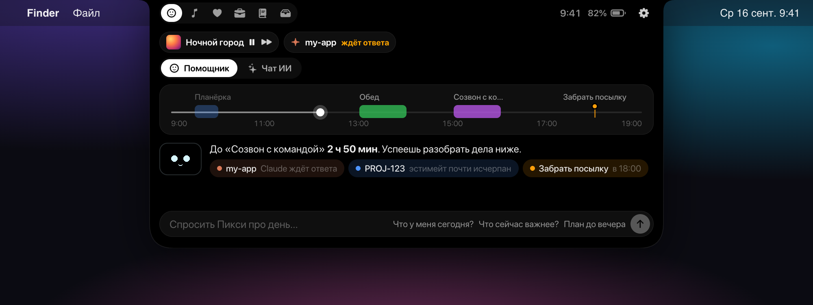<br><b>Помощник</b>: шкала дня со встречами и напоминаниями, что ждёт внимания, вопрос помощнику</td>
    <td width="50%">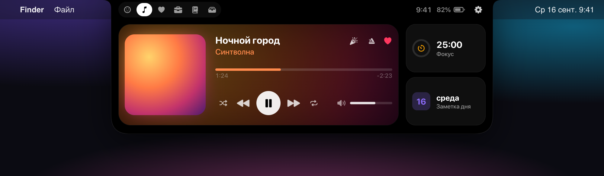<br><b>Музыка</b>: плеер с перемоткой и громкостью, рядом фокус-таймер и заметка дня</td>
  </tr>
  <tr>
    <td width="50%">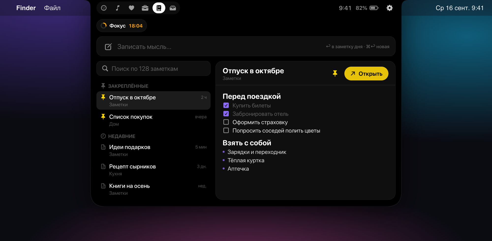<br><b>Заметки</b>: быстрая запись, поиск, закреплённые и превью с чекбоксами</td>
    <td width="50%">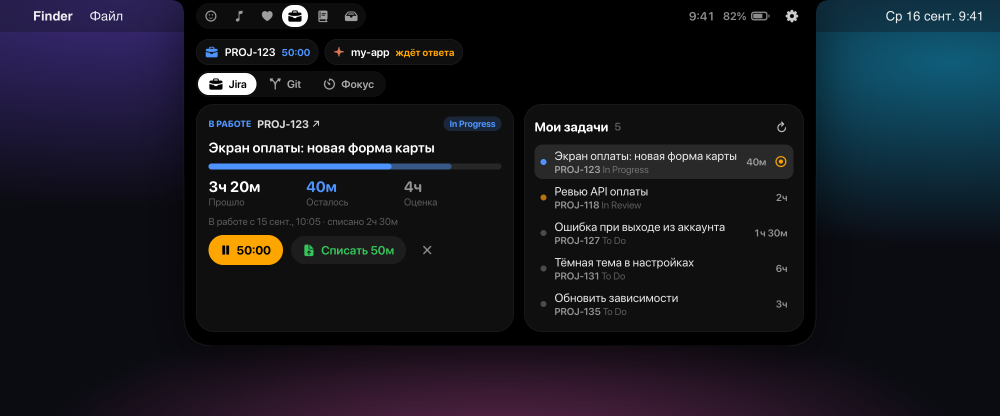<br><b>Работа</b>: задача в работе с таймером и списанием времени, список задач Jira</td>
  </tr>
  <tr>
    <td width="50%">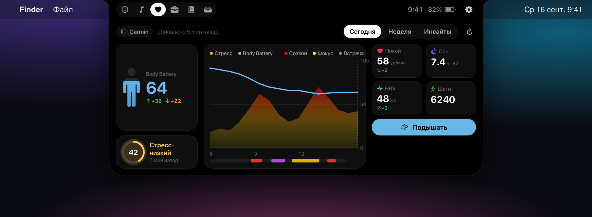<br><b>Здоровье</b>: Body Battery, стресс, график дня и дыхание</td>
    <td valign="middle" align="center"><sub>Иллюстрации повторяют раскладку приложения,<br>данные на них выдуманные.</sub></td>
  </tr>
</table>

<a id="возможности"></a>
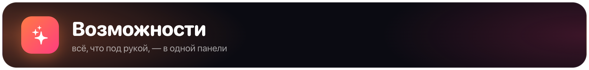

- **Помощник** — живая мордочка под вырезом (см. выше). Реагирует на музыку, фокус, заметки, файлы и зарядку, напоминает попить воды и размяться. Клик — взаимодействие, двойной клик — задачи на сегодня и статистика дня.
- **Музыка** — Яндекс Музыка, Spotify, Apple Music и браузер через «Сейчас играет»: обложка, перемотка, громкость, цвет от обложки.
- **Заметки** — быстрая запись в заметку дня, поиск, превью с чекбоксами, закреплённые заметки. Obsidian или Apple Notes.
- **Календарь и напоминания** — ближайшие встречи и дела на сегодня.
- **Созвоны** — запись, расшифровка на этом компьютере и протокол встречи.
- **Jira** — задачи в работе, таймер и списание времени.
- **Git** — состояние репозитория, в котором вы сейчас работаете.
- **ИИ-чат** — Claude Code, Codex, OpenAI по ключу или свой OpenAI-совместимый сервер (например, Ollama).
- **Агенты** — NotchMate показывает, когда Claude Code ждёт ответа, и даёт агентам свои инструменты через MCP.
- **Здоровье** — стресс, Body Battery и сон из Garmin Connect, дыхательные упражнения.
- **Полка**, **буфер обмена** (без паролей) и **фокус-таймер**.

Горячие клавиши: ⌃⌥N — открыть, ⌃⌥M — быстрая заметка, ⌘1–6 — вкладки, Esc — закрыть.

<a id="установка"></a>
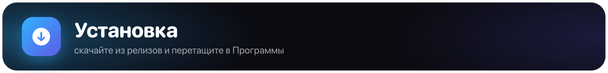

1. Скачайте `NotchMate-…-arm64.zip` из [последнего релиза](https://github.com/aleksandr-developer1/notchmate/releases).
2. Распакуйте архив и перетащите **NotchMate** в папку «Программы».
3. При первом запуске macOS скажет, что не может проверить разработчика: приложение пока не нотаризовано Apple. Откройте «Системные настройки → Конфиденциальность и безопасность» и нажмите **«Всё равно открыть»** напротив NotchMate. То же самое одной командой в Терминале:
   ```bash
   xattr -dr com.apple.quarantine /Applications/NotchMate.app
   ```
4. Выдайте разрешения, которые попросит NotchMate: без них просто не работают отдельные функции.

> После установки новой версии macOS может попросить выдать разрешения заново: релизы подписаны без сертификата разработчика.

## Требования

- macOS 14 Sonoma или новее, Apple Silicon.
- Xcode или Command Line Tools со Swift 5.10+.
- MacBook с вырезом — желательно: на остальных Mac панель крепится к верху экрана.

<a id="сборка"></a>
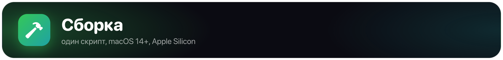

```bash
git clone --recursive https://github.com/aleksandr-developer1/notchmate.git
cd notchmate
./build.sh            # соберёт build/NotchMate.app
./build.sh install    # и установит в /Applications, затем запустит
```

Если клонировали без `--recursive`, `build.sh` сам подтянет подмодуль `Vendor/mediaremote-adapter`.

**Подпись.** macOS привязывает выданные разрешения (Универсальный доступ, Автоматизация, микрофон и другие) к подписи приложения. `build.sh` берёт первый сертификат Apple Development / Developer ID из связки ключей. Без сертификата используется ad-hoc подпись, и после каждой пересборки разрешения придётся выдавать заново. Задать сертификат явно: `SIGN_ID="<имя или SHA-1>" ./build.sh`.

## Разрешения

При первом запуске NotchMate покажет, какие разрешения нужны и зачем. Все они необязательны — без разрешения просто не работает соответствующая функция:

| Разрешение | Для чего |
|---|---|
| Универсальный доступ | горячие клавиши, текущее окно и репозиторий |
| Автоматизация | «Заметки», вкладки браузера, плеер |
| Микрофон и запись экрана | запись созвонов |
| Распознавание речи | расшифровка на устройстве |
| Календари, Напоминания | встречи и дела на сегодня |

<a id="приватность"></a>
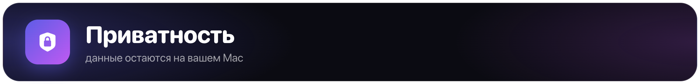

- Все данные хранятся локально: `~/Library/Application Support/NotchMate` и настройки macOS.
- Токены Jira и ключи ИИ хранятся в `~/Library/Application Support/NotchMate/secrets.json`, доступном только вашей учётной записи (права 600). Системная Связка ключей не используется, чтобы macOS не спрашивала доступ при каждой пересборке.
- Расшифровка созвонов выполняется на этом Mac.
- Запросы в ИИ уходят только к тому провайдеру, которого вы выбрали в настройках.
- Буфер обмена не сохраняет пароли и содержимое, помеченное как конфиденциальное.

<a id="claude-code"></a>
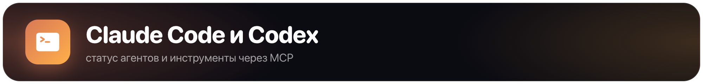

NotchMate работает как MCP-сервер для Claude Code и Codex и принимает их хуки, чтобы показывать, что агент ждёт ответа. Всё подключается одной кнопкой в «Настройки → Интеграции». Вручную MCP добавляется так:

```bash
claude mcp add --scope user notchmate -- /Applications/NotchMate.app/Contents/MacOS/NotchMate --mcp
```

## Структура

```
Sources/NotchMate/  исходный код, по папке на функцию (Media, Jira, Calls, AI…)
Resources/          Info.plist, иконка, анимации помощника, скрипт синхронизации Garmin
Vendor/             mediaremote-adapter (git-подмодуль)
docs/images/        картинки для README
```

## Лицензия

[MIT](LICENSE). Сторонние компоненты и их лицензии — в [THIRD_PARTY_NOTICES.md](THIRD_PARTY_NOTICES.md).

NotchMate использует закрытый системный фреймворк MediaRemote, поэтому её нельзя публиковать в Mac App Store, а обновление macOS может сломать блок «Музыка».
