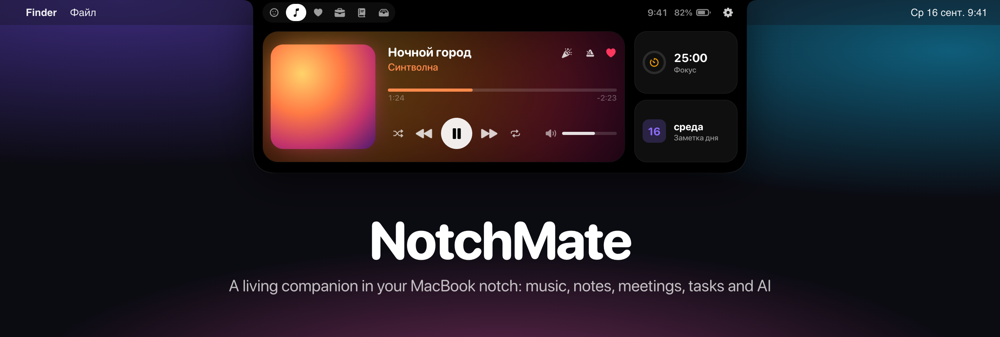
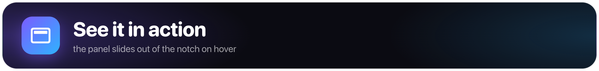
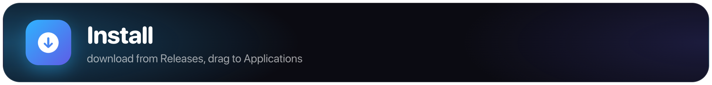
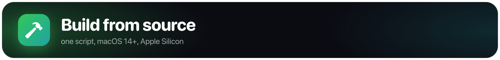
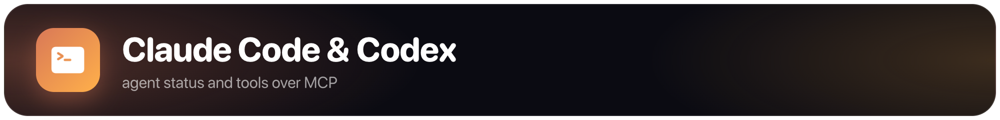

<p align="center">
  
</p>

<p align="center">
  <a href="https://github.com/aleksandr-developer1/notchmate/releases"></a>
  <a href="https://github.com/aleksandr-developer1/notchmate/releases"></a>
  
  
  
  <a href="LICENSE"></a>
  <a href="https://github.com/aleksandr-developer1/notchmate/stargazers"></a>
</p>

<p align="center"><a href="README.ru.md">Русский</a> · <b>English</b></p>

# NotchMate

> [!WARNING]
> **Beta.** NotchMate is used every day, but it is still being polished: expect bugs, and the UI and settings will change. If something breaks, please open an issue.

**Turn the dead space around your MacBook notch into a living companion.** Hover the notch and a panel slides out with your music, notes, today's meetings, Jira tasks, call recording, health data and an AI chat — plus a tiny pixel pet that reacts to what you're doing. Free, open source, and your data stays on your Mac.

<p align="center">
  <a href="https://github.com/aleksandr-developer1/notchmate/releases/latest"></a>
</p>

> [!NOTE]
> The app's interface is in **Russian** for now. English localization is planned — help with it is very welcome.

## Meet your companion

NotchMate has a living pixel face. It dances to your music, gets serious while you focus, reacts to files and charging, and reminds you to drink water. Almost 40 animations — these are real frames from the app:

<p align="center">
  
</p>

<a id="see-it-in-action"></a>


Hover the notch and the panel slides down. Tabs: Companion, Music, Health, Work, Notes and Shelf.

<table>
  <tr>
    <td width="50%"><br><b>Companion</b>: a timeline of meetings and reminders, what needs your attention, ask the companion about your day</td>
    <td width="50%"><br><b>Music</b>: player with seeking and volume, plus a focus timer and today's note</td>
  </tr>
  <tr>
    <td width="50%"><br><b>Notes</b>: quick capture, search, pinned notes and a preview with checkboxes</td>
    <td width="50%"><br><b>Work</b>: the issue in progress with a timer and worklogs, your Jira issues</td>
  </tr>
  <tr>
    <td width="50%"><br><b>Health</b>: Body Battery, stress, today's chart and breathing</td>
    <td valign="middle" align="center"><sub>Illustrations follow the app's real layout;<br>the data in them is made up.</sub></td>
  </tr>
</table>

<a id="features"></a>


- **Companion** — a living face under the notch. Reacts to music, focus, notes, files and charging; reminds you to drink water and stretch. Click to interact, double-click for today's tasks and stats.
- **Music** — Yandex Music, Spotify, Apple Music and the browser via Now Playing: artwork, seeking, volume, colors from the cover.
- **Notes** — quick capture into your daily note, search, previews with checkboxes, pinned notes. Obsidian or Apple Notes.
- **Calendar & reminders** — upcoming meetings and today's to-dos.
- **Calls** — recording, on-device transcription and meeting minutes.
- **Jira** — issues in progress, a timer and worklogs.
- **Git** — the state of the repository you're working in.
- **AI chat** — Claude Code, Codex, OpenAI with your key, or your own OpenAI-compatible server (e.g. Ollama).
- **Agents** — see when Claude Code is waiting for you; agents get NotchMate's tools over MCP.
- **Health** — stress, Body Battery and sleep from Garmin Connect, breathing exercises.
- **Shelf** for files, **clipboard history** (no passwords) and a **focus timer**.

Shortcuts: ⌃⌥N — open, ⌃⌥M — quick note, ⌘1–6 — tabs, Esc — close.

<a id="install"></a>


1. Download `NotchMate-…-arm64.zip` from the [latest release](https://github.com/aleksandr-developer1/notchmate/releases).
2. Unzip it and drag **NotchMate** into Applications.
3. On first launch macOS will say it can't verify the developer — the app isn't notarized by Apple yet. Open **System Settings → Privacy & Security** and click **Open Anyway** next to NotchMate. Or run in Terminal:
   ```bash
   xattr -dr com.apple.quarantine /Applications/NotchMate.app
   ```
4. Grant the permissions NotchMate asks for — without them only the related feature is off.

> After installing a new version macOS may ask for permissions again: releases are signed without a developer certificate.

## Requirements

- macOS 14 Sonoma or later, Apple Silicon.
- A MacBook with a notch is ideal; on other Macs the panel sits at the top of the screen.
- To build: Xcode or Command Line Tools with Swift 5.10+.

<a id="build"></a>


```bash
git clone --recursive https://github.com/aleksandr-developer1/notchmate.git
cd notchmate
./build.sh            # builds build/NotchMate.app
./build.sh install    # and installs it to /Applications, then launches it
```

If you cloned without `--recursive`, `build.sh` fetches the `Vendor/mediaremote-adapter` submodule itself.

**Signing.** macOS ties granted permissions (Accessibility, Automation, microphone and others) to the app's signature. `build.sh` uses the first Apple Development / Developer ID certificate in your keychain; without one it signs ad hoc, and permissions have to be granted again after every rebuild. Pick a certificate explicitly with `SIGN_ID="<name or SHA-1>" ./build.sh`.

## Permissions

On first launch NotchMate shows which permissions it needs and why. All of them are optional — without one, only the related feature is off:

| Permission | Used for |
|---|---|
| Accessibility | hotkeys, the current window and repository |
| Automation | Notes, browser tabs, the player |
| Microphone & screen recording | recording calls |
| Speech recognition | on-device transcription |
| Calendars, Reminders | today's meetings and to-dos |

<a id="privacy"></a>


- All data stays local: `~/Library/Application Support/NotchMate` and macOS preferences.
- Jira tokens and AI keys are stored in `~/Library/Application Support/NotchMate/secrets.json`, readable only by your user account (mode 600). The system Keychain isn't used so macOS doesn't prompt for access after every rebuild.
- Calls are transcribed on your Mac.
- AI requests go only to the provider you pick in the settings.
- Clipboard history skips passwords and content marked as confidential.

<a id="claude-code"></a>


NotchMate works as an MCP server for Claude Code and Codex and receives their hooks to show when an agent is waiting for you. Connect everything with one button in **Settings → Integrations**, or add the MCP server by hand:

```bash
claude mcp add --scope user notchmate -- /Applications/NotchMate.app/Contents/MacOS/NotchMate --mcp
```

## Project layout

```
Sources/NotchMate/  source code, one folder per feature (Media, Jira, Calls, AI…)
Resources/          Info.plist, icon, companion animations, Garmin sync script
Vendor/             mediaremote-adapter (git submodule)
docs/images/        README images
```

## License

[MIT](LICENSE). Third-party components and their licenses are listed in [THIRD_PARTY_NOTICES.md](THIRD_PARTY_NOTICES.md).

NotchMate uses the private MediaRemote framework, so it can't ship on the Mac App Store, and a macOS update may break the Music block.

---

<p align="center">If NotchMate makes your day a little nicer, please ⭐ star the repo — it really helps the project grow.<br>
Bugs and ideas go to <a href="https://github.com/aleksandr-developer1/notchmate/issues">issues</a>, questions to <a href="https://github.com/aleksandr-developer1/notchmate/discussions">discussions</a>. Want to help with code? See <a href="CONTRIBUTING.md">CONTRIBUTING</a>.</p>
